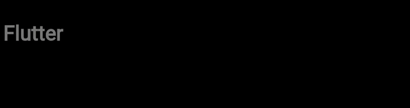

# 🎉 Flutter Text Animations Playground

A collection of fun and creative text animations built using **Flutter**, inspired by the awesome [react-bits](https://github.com/DavidHDev/react-bits) repository.

This project showcases multiple text effects that can be used in portfolios, intros, onboarding screens, or just for fun UI experimentation.

---
### Blur Text Animation




## ✨ Features

✔️ **BlurText** – A smooth blur-in/out effect cycling through multiple words  
✔️ **RotationText** – Rotates each word in sequence  
✔️ **TextPressure** – Expands and compresses letters like a breathing effect  
✔️ **GradientText** – Animated gradient over the text  
✔️ **CircularText** – Wraps text in a circular path  
✔️ **GlitchTextLetter** – Classic glitch effect on each character  
✔️ **ShinnyText** – Reflective shine sweeps across the text  
✔️ **CurvedLoop** – Loops text along a curved path (experimental)

---

## 🛠 Getting Started

### 🔧 Prerequisites

- Flutter SDK (any stable channel)
- Dart enabled IDE (VSCode, Android Studio)

### 🚀 Run the App

```bash
git clone https://github.com/yourusername/flutter-text-animations.git
cd flutter-text-animations
flutter pub get
flutter run
